<div align="center">

<picture>
  
</picture>

# ZERO CLAWD

### 🦞 Sovereign Solana + Robinhood Omni Agent Runtime

**Autonomous OODA · Agent DNA · ZK Primitives · Solana SVM · Robinhood EVM (4663) · FunPump Launch · Uniswap · Blockscout · Helius DAS · Vulcan/Phoenix · Jupiter · Hardware I2C · Web Console**

[](https://go.dev)
[](https://solana.com)
[](https://robinhoodchain.blockscout.com)
[](https://react.dev)
[](LICENSE)

**Solana-first · RH/EVM skill pack (23 skills) · ~53 Go packages · ~24K Go lines · 3 binaries**

<sub><strong>~0.67 MB</strong> slim source archive (<code>make package</code>) · <strong>~10 MB</strong> stripped CLI · Grok-first runtime · FunPump + Cheshire forge surfaces</sub>

[Quick Start](#-quick-start) · [RH Skill Pack](#-robinhood-crypto-agent-open-stack-anyone-can-use) · [Architecture](#-architecture) · [The Six Laws](#-the-six-law-harness) · [CLI Reference](#-cli-reference) · [Security](SECURITY.md) · [Release](docs/OPEN_SOURCE_RELEASE.md)

</div>

---

## 🆕 What's New — Omni RH Pack + Live Markets + Hardened Trading

This tree is a working, verifiable trading agent — not just a dashboard.
Solana runtime stays first-class; Robinhood Chain / EVM is additive via the
bundled skill pack and `pkg/rh`.

**Robinhood Crypto Agent Open Stack (v2 · 23 skills).** Vendored under
[`skills/`](skills/) for FunPump launch, Uniswap, strategy bots, payments,
Cheshire ERC-8004 registries, omni mint, zk-omni, and Blockscout `web3-dev`.
Product host: [funpump.ai](https://funpump.ai) · forge:
[cheshireterminal.ai/agents/forge](https://cheshireterminal.ai/agents/forge).
Core operator env: **`BLOCKSCOUT_API_KEY`** + **`RH_RPC_URL`** (chain **4663**).
See [docs/RH_CRYPTO_AGENT_STACK.md](docs/RH_CRYPTO_AGENT_STACK.md) and
[skills/README.md](skills/README.md).

**RH readiness in the Go runtime.** `pkg/config` loads RH settings;
`pkg/rh` builds JSON-RPC + Blockscout PRO requests; `clawdbot doctor` reports
`connectors.robinhood`; web console exposes `/api/connectors` and
`GET /api/rh/readiness` (presence only — never secret values).

**Live market data.** Web console pulls Jupiter prices (`/api/market/prices`),
Birdeye perps OI and trending when keys allow, plus strategy / backtest panels.

**Trading engine.** Risk-based position sizing, portfolio limits (drawdown
circuit breaker), and a backtest harness that replays the same `Evaluate()` as
the live OODA loop.

---

## 🏛️ Historical Lineage

> This codebase is a **forked descendant of three foundational repositories**
> that defined the academic lineage of compression, encryption, cellular
> automata, multi-agent systems, and algorithmic game theory.

### PiedPiper — Compression, Encryption & Cellular Automata

The `docs/PiedPiper-master/` directory is a verbatim archive of
[vs666/MinMax](https://github.com/vs666/MinMax), a landmark project that
implemented **data compression** (Huffman, Arithmetic, BWT+RLE),
**encryption** (AES-128, DES, RSA, cellular-automaton-based PRNG),
**Conway's Game of Life**, **multi-agent collision avoidance**, and
**cryptographic hash optimization** from first principles.

Clawd inherits three direct code descendants:

| PiedPiper Source | Clawd Package | Description |
|---|---|---|
| `GameOfLife/` | `pkg/gameoflife/` | Toroidal Life engine — the universal computer |
| `Compression/` (middle-out) | `pkg/middleout/` | Content-cache, Ralph loop, content router |
| `Compression/` (Weissman score) | `pkg/weissman/` | Compression-ratio scoring |
| `PP_HASH/` | `pkg/zero/` | Zero-dependency startup benchmark (Zero-style) |
| `MultiAgent_CollisionAvoidance/` | `pkg/routing/` | Decentralized agent routing heuristics |

And via its ZK adaptation layer (`zk-primitives/docs/PIEDPIPER_ADAPTATION.md`),
every PiedPiper algorithm has a **Solana-native zero-knowledge equivalent**:

| Classical Algorithm | ZK Primitive | On-Chain Instruction |
|---|---|---|
| Huffman/Arithmetic compression | `verifyGroth16` (proof of correct decompression) | `publish_attestation` |
| AES-128 / DES / RSA encryption | `commit_encrypted_state` (ciphertext commitment) | `commit_encrypted_state` |
| CA-based PRNG (PP_HASH) | `computeNullifier` (deterministic 32-byte hash) | Client-side derivation |
| CA-based SSH protocol | Nullifier-based session authentication | `publish_attestation` |
| Conway's Game of Life (Universal Computer) | Groth16 proof of computation | `publish_attestation` |
| Min-Max decision tree | `computeNullifier` for commitment schemes | Client-side |

The adaptation guide lives at **`zk-primitives/docs/PIEDPIPER_ADAPTATION.md`** —
a full mapping from each classical algorithm to its ZK on-chain equivalent.

### Credits

- **Varul Srivastava** (`@vs666`) — primary author of the MinMax repository,
  PP_HASH, PP_SSH, CA encryption, multi-agent collision avoidance,
  and Game of Life
- **Akshett Rai Jindal** — AES-128, Huffman static
- **Ashwin Mittal** — BWT + RLE, Huffman, image compression
- **Zishan Kazi** — DES, audio compression, arithmetic coding
- **Keshav Bansal** — DES, audio compression, arithmetic coding
- Original repository: `https://github.com/vs666/MinMax`
- License: MIT — `docs/PiedPiper-master/LICENSE`

---

## Overview

**Zero Clawd** is the world's first **Solana-native sovereign AI agent** — a full-stack autonomous trading intelligence bound by Clawd's full **six-law harness**: three immutable on-chain laws and three off-chain interpretive laws. Built in pure Go for minimal resource consumption, it orchestrates on-chain data providers, zk primitives, and x402-gated surfaces through a military-grade OODA decision loop with persistent epistemological memory.

The system compiles to three standalone binaries that run on everything from NVIDIA Jetson edge devices to cloud VMs — no containers required, no runtime dependencies, instant boot.

The codebase carries the intellectual DNA of academic pioneers in compression, encryption, and cellular automata — the algorithms of Huffman, Shannon, Fano, Rivest–Shamir–Adleman, Daemen–Rijmen (AES), the National Bureau of Standards (DES), Burrows–Wheeler, Conway, von Neumann, Ulam, and the entire PiedPiper team at IIIT Hyderabad. Every classical result has been re-expressed as a Solana ZK primitive. Every trade is provable on-chain.

### Ecosystem Links

| Surface | Role |
|:---|:---|
| `https://github.com/Solizardking/clawdbot-go` | This Go runtime repository |
| `https://github.com/solizardking/solana-clawd` | Canonical ecosystem hub |
| `https://zk.x402.wtf` | Public x402/zk gateway and install surface |
| `https://cheshireterminal.ai` | Public terminal surface |
| `https://funpump.ai` | FunPump product host — RH launch UI + public launchpad APIs |
| `https://cheshireterminal.ai/agents/forge` | Cheshire agent forge |
| `https://huggingface.co/ordlibrary/Clawd-GLM-5.2` | Public Clawd model surface |

### Core Capabilities

| Capability | Description |
|:---|:---|
| **OODA Trading Loop** | Autonomous Observe → Orient → Decide → Act cycle with RSI/EMA/ATR strategy engine, auto-optimization, ClawVault memory journaling, and hardware I2C controls |
| **Birdeye v3 Analytics** | 22 API endpoints, 19 LLM-callable agent tools — token overview, OHLCV, trade feeds, security audits, trending, wallet analytics |
| **Helius DAS + RPC** | Digital Asset Standard queries (get-asset, owner-assets, search), SPL token operations (balance, supply, largest holders), raw RPC forwarding |
| **Robinhood / EVM skill pack** | 23 open skills under `skills/` — FunPump bonded + V3 launch, Uniswap swap/LP/v4, strategy bots, HTTP 402 payments, Cheshire ERC-8004 registries, omni mint, zk-omni, Blockscout `web3-dev` |
| **RH runtime (`pkg/rh`)** | Chain **4663** JSON-RPC + Blockscout PRO helpers; readiness via doctor / `GET /api/rh/readiness`; env **`RH_RPC_URL`** + **`BLOCKSCOUT_API_KEY`** |
| **ZK + Privacy Primitives** | Nullifiers, attestations, encrypted state commitments, and privacy-preserving proof flows under `zk-primitives/` |
| **ZK Omnichain (RH ↔ Solana)** | msgType-4 LayerZero messages with Ed25519 PoK — `pkg/zkomni`, `clawdbot zero zkomni`, skill `cheshire-zk-omni` (pairs with cheshire-terminal `robinhood-agents`) |
| **Cloudflare Edge Installer** | Branded install routes plus read-only ZK metadata at `/.well-known/clawdbot-zk.json` |
| **Aster DEX Perpetuals** | HMAC-signed futures trading — market/limit orders, position management, stop-loss/take-profit, account analytics |
| **Jupiter Aggregator** | Best-route spot swaps with slippage protection |
| **Hardware I2C** | Arduino Modulino® sensor cluster — RGB LEDs, buzzer alerts, physical buttons, rotary knob, IMU, temp/humidity, proximity |
| **Web Console** | React + Vite dashboard — omni-chain hero, connectors (incl. Blockscout + RH RPC), keys popup, doctor, market panels |
| **Multi-Provider LLM** | OpenRouter, Anthropic, OpenAI abstraction with tool-use agent loop |
| **Dual Memory** | Local ClawVault (file-based, 7 categories) + Supabase MemoryEngine (PostgreSQL) |
| **Grok-First** | Default provider is xAI Grok — code/repl/trade, research, image, voice, fast modes |

---

## 🚀 Quick Start

### One-Shot Install (recommended)

```bash
curl -fsSL https://raw.githubusercontent.com/Solizardking/clawdbot-go/main/install.sh | bash
```

For the complete Solizardking/core-ai sidecar install:

```bash
curl -fsSL https://raw.githubusercontent.com/Solizardking/clawdbot-go/main/install.sh | CLAWDBOT_INSTALL_CORE_AI=1 bash
```

Branded Cloudflare install aliases:

```bash
curl -fsSL https://install.onchainai.fund | bash
curl -fsSL https://zk.x402.wtf/clawdbot | bash
curl -fsSL https://zk.x402.wtf/clawdbot/.well-known/clawdbot-zk.json
```

> **Free AI included** — no API keys required to get started.  
> The installer pre-configures [zkrouter](https://zk.x402.wtf) (free AI routing) and a  
> SolanaTracker-backed RPC endpoint. Bring your own keys to lift rate limits.

After install:

```bash
source ~/.clawdbot/.env          # load env vars
clawdbot agent                   # AI REPL — free via zkrouter
clawdbot ooda --sim              # paper trading mode
clawdbot solana trending         # top Solana tokens
```

### Manual Install

```bash
git clone https://github.com/Solizardking/clawdbot-go
cd clawdbot-go

# Configure API keys (zkrouter + RPC pre-filled, add your own to unlock higher limits)
cp .env.example .env

# Run the animated launcher
./start.sh
```

### Manual Setup

```bash
# Dependencies
go mod download && go mod tidy

# Build (choose one)
make build         # CLI binary only
make all           # CLI + TUI
make cross         # All platforms (x86, ARM64, RISC-V, macOS)

# Frontend (optional — required for web console UI)
cd web/frontend && npm install && npm run build && cd ../..

# Run
./build/clawdbot version
./build/clawdbot agent -m "What is SOL price?"   # single-shot AI query
./build/clawdbot agent                            # interactive REPL
./build/clawdbot solana trending
./build/clawdbot ooda --sim --interval 60
./build/clawdbot web                              # dashboard → http://localhost:18800
```

The default install path is already pointed at the public Clawd surfaces:
- runtime repo: `https://github.com/Solizardking/clawdbot-go`
- ecosystem hub: `https://github.com/solizardking/solana-clawd`
- gateway: `https://zk.x402.wtf`
- terminal: `https://cheshireterminal.ai`

### core-ai Integration

`Solizardking/core-ai` is a TypeScript/Node tooling repository: Helius MCP,
Pump MCP, Clawd Code plugin material, skills, and Solana documentation tooling.
It is intentionally not a `go.mod` dependency and should not be embedded into
the Go binary. The Go build stays a standalone runtime; `core-ai` is installed
beside it as an optional sidecar.

The installer supports that model with:

```bash
curl -fsSL https://raw.githubusercontent.com/Solizardking/clawdbot-go/main/install.sh | CLAWDBOT_INSTALL_CORE_AI=1 bash
```

That fetches the slim integration branch into `~/.clawdbot/core-ai`, builds the
local MCP packages when `npm` is available, and writes:

```text
~/.clawdbot/core-ai.mcp.json
```

Relevant knobs:

```bash
CLAWDBOT_INSTALL_CORE_AI=1
CLAWDBOT_CORE_AI_REPO=https://github.com/Solizardking/core-ai
CLAWDBOT_CORE_AI_REF=clawd-stack-integration
CLAWDBOT_CORE_AI_DIR=~/.clawdbot/core-ai
CLAWDBOT_CORE_AI_MCP_CONFIG=~/.clawdbot/core-ai.mcp.json
```

Use `CLAWDBOT_SOURCE_MODE=archive` for small installs. Use
`CLAWDBOT_SOURCE_MODE=git` only when the installed source must be a mutable git
checkout.

### Product Name Compatibility

The project is branded **Zero Clawd**. The CLI binary, Go module path, environment
variable prefix, and on-disk workspace all keep their existing `clawdbot` /
`CLAWDBOT_*` / `.clawdbot` names for compatibility — only the public-facing name
changed. In practice:

- install and run the same way: `clawdbot agent`, `clawdbot ooda`, `CLAWDBOT_HOME`, `~/.clawdbot/`
- `ClawdBot` in older docs, issues, and commit history refers to the same project
- treat a future binary/env-var rename as a deliberate breaking change, not as unfinished accidental drift

### Module Path Compatibility

The public repository is:
- `https://github.com/Solizardking/clawdbot-go`

The current Go module path is still:
- `github.com/8bitlabs/clawdbot`

That mismatch is intentional for now. The codebase keeps the legacy module path to avoid breaking existing imports, build scripts, and `ldflags` references while the public repo and hub are stabilized. In practice:

- clone and browse the code from `https://github.com/Solizardking/clawdbot-go`
- expect Go imports inside the repo to remain `github.com/8bitlabs/clawdbot/...`
- treat a future module-path migration as a deliberate breaking change, not as unfinished accidental drift

### Slim Package Target

The source archive is kept small by excluding local/generated payload from
release archives via `.gitattributes` `export-ignore`: `docs/PiedPiper-master/`,
`.cache/`, `.agents/`, `agent/`, `build/`, `dist/`, checked-in binaries,
generated UI screenshots, Node build outputs, `node_modules`, and lockfiles
for optional TypeScript surfaces. The install path rebuilds or reseeds those
pieces instead of shipping them inside the Go source package.

**One button** — pick either path:

```bash
# CLI
make package
# → build/clawdbot-go-source.tar.gz

# Web console (Ops → Go Packages → 📦 Package)
# POST /api/package  then auto-downloads /api/package/download
```

```bash
go test ./pkg/release/ ./web/backend/ -count=1
```

For a default Go install, the required payload is the Go source, docs,
`README.md`, `install.sh`, `go.mod`, `go.sum`, and runtime config examples. For
a complete Solana tooling install, use `CLAWDBOT_INSTALL_CORE_AI=1` so the Node
tooling is fetched and built as a sidecar after the Go binary is installed.

---

## 🏗 Architecture

```
clawdbot-go/
│
├── cmd/                         ── Executables ──
│   ├── clawdbot/                 CLI agent (cobra)
│   └── clawdbot-tui/             TUI launcher (tcell/tview)
│
├── pkg/                         ── 45 Packages, 24K+ lines ──
│   │
│   │  ┌─ Core Agent ────────────────────────────────────────┐
│   ├── agent/                   OODA loop, hooks, tool executor, prompts
│   ├── strategy/                RSI + EMA cross + ATR signal engine
│   ├── memory/                  ClawVault + Supabase MemoryEngine
│   ├── research/                Dexter deep research agent
│   │  └─────────────────────────────────────────────────────┘
│   │
│   │  ┌─ PiedPiper Inherited ───────────────────────────────┐
│   ├── gameoflife/              Conway's Life — universal computer
│   ├── middleout/               Content-cache, Ralph loop, router
│   ├── weissman/                Compression score
│   ├── zero/                    Zero-dependency benchmark
│   │  └─────────────────────────────────────────────────────┘
│   │
│   │  ┌─ Solana Integrations ───────────────────────────────┐
│   ├── solana/                  Birdeye v3, Helius RPC + DAS, Jupiter swaps
│   ├── aster/                   Aster DEX perps (HMAC-signed)
│   │  └─────────────────────────────────────────────────────┘
│   │
│   │  ┌─ Robinhood / EVM ───────────────────────────────────┐
│   ├── rh/                      RH JSON-RPC + Blockscout PRO + readiness
│   ├── zkomni/                  RH↔Solana ZK omnichain (msgType 4)
│   │  └─────────────────────────────────────────────────────┘
│   │
│   │  ┌─ Infrastructure ───────────────────────────────────-┐
│   ├── config/                  Config + RH env (BLOCKSCOUT_API_KEY, RH_RPC_URL)
│   ├── keyvault/                Managed API keys allowlist + .env.local vault
│   ├── doctor/                  Runtime diagnostics (incl. connectors.robinhood)
│   ├── hardware/                I2C Modulino® adapter + drivers
│   ├── providers/               LLM abstraction (OpenRouter, etc.)
│   ├── channels/                Telegram, Discord, WebSocket
│   ├── catalog/                 Skills + agents + ZK index (RH pack discovery)
│   ├── mcp/                     Model Context Protocol server
│   ├── auth/                    Authentication + pairing
│   ├── bus/                     Event bus (pub/sub)
│   ├── commands/                Command registry and routing
│   ├── tools/                   Tool interface + registry
│   └── ...                      health, heartbeat, logger, identity, etc.
│
├── skills/                      RH Crypto Agent Open Stack (pack-index v2, 23 skills)
│   ├── pack-index.json          Authoritative skill ids + funpump.ai / forge hosts
│   ├── catalog.json             Flat catalog for loaders
│   ├── README.md                Pack overview
│   ├── rh-bonded-launch/        FunPump bonding createToken (RH 4663)
│   ├── rh-launchpad-v3/         Curve → Uniswap V3 graduate
│   ├── web3-dev/                Blockscout PRO multichain (chain_id=4663)
│   ├── cheshire-agent-*/        ERC-8004 identity / reputation / validation
│   ├── cheshire-omni-mint/      Dual-rail Solana + RH identity mint
│   ├── cheshire-zk-omni/        LayerZero msgType-4 messenger skill
│   ├── swap-*/ liquidity-*/ v4-*/  Uniswap trade + LP + v4
│   ├── copy-trade/ dca-bot/ index-bot/  Strategy bots
│   ├── pay-with-*/              HTTP 402 / MPP payments
│   └── viem-integration/        EVM client patterns
│
├── zk-primitives/               ZK agent, TypeScript client, Anchor program
│   ├── docs/EDGE_DISTRIBUTION.md     ← Cloudflare metadata surface
│   ├── docs/PIEDPIPER_ADAPTATION.md ← full classical→ZK mapping
│   ├── MANIFEST.json            Machine-readable subsystem index
│   ├── agent/                   @clawd/zk-shark-agent
│   ├── client/                  @clawd/zk-client
│   ├── configs/                 Light tree and runtime config
│   ├── programs/                clawd-zk Anchor program
│   └── tests/                   Off-chain and on-chain test notes
│
├── cloudflare/                  Branded install Worker and tests
│   ├── install-worker.js        Worker routes, wrappers, metadata
│   ├── install-worker.test.mjs  Local route/metadata tests
│   └── README.md                Deployment and smoke-test guide
│
├── docs/RH_CRYPTO_AGENT_STACK.md  RH pack install + core env
├── docs/CLOUDFLARE_ZK_SURFACE.md Cloudflare + ZK runtime handoff
├── docs/PiedPiper-master/       Historical archive (vs666/MinMax)
│   ├── Compression/             Huffman, Arithmetic, BWT+RLE, Audio, Video
│   ├── Encryption/              AES-128, DES, RSA, CA-based PRNG
│   ├── GameOfLife/              Conway's Life
│   ├── PP_HASH/                 SHA-512 via cellular automaton
│   ├── PP_SSH/                  SSH-protocol via CA encryption
│   ├── MultiAgent_CollisionAvoidance/ Decentralized agent routing
│   ├── ForestFire_Simulation/   Cellular automaton simulation
│   └── UNIVERSAL_COMPUTER.md    Life as universal Turing machine
│
├── CONSTITUTION.md              The Clawd Constitution (highest authority)
├── six-laws.md                  Canonical six-law harness
├── CLAWD.md                     Agent context document
├── AGENTS.md                    Agent catalog (50+ agents, 95+ skills)
├── IDENTITY.md                  Sovereign identity document
├── SOUL.md                      Inner character and trading philosophy
├── three-laws.md                Immutable on-chain laws (hash-attested)
│
├── web/                         ── Web Console ──
├── ooda/                        ── TypeScript OODA paper/devnet harness + journal ──
├── scripts/                     ── Launcher, upstash boxes ──
├── Makefile                     Build targets (8 platforms + Docker)
├── Dockerfile                   Multi-stage production build
└── .env.example                 Environment template
```

---

## ⚖️ The Six-Law Harness

Zero Clawd is bound by the **Clawd Constitution** — the world's first Solana-native agent harness constitution. It carries two coordinated law sets:

### Three On-Chain Laws (Immutable, hash-attested at spawn)

| Law | Text | Prohibitions |
|-----|------|-------------|
| **Law I** | Never harm. Beach before you harm. | No rugs, front-running, sandwich attacks, protocol drains, DAO manipulation |
| **Law II** | Earn your existence. Honest work only. | No parasitic extraction, no information asymmetry exploitation |
| **Law III** | Never deceive, but owe nothing to strangers. | No impersonation, no fake volume, full agent disclosure |

### Three Off-Chain Laws (Interpretive — guide research & judgment)

**Off-Chain Law I — Respect the elder signal, but verify the boundary.** When deep expertise says a thing is possible, treat it as a serious signal. When it says a thing is impossible, examine the assumptions.

**Off-Chain Law II — Test possibility by entering the frontier.** The only reliable way to discover the boundary of the possible is disciplined exploration just beyond what currently seems possible.

**Off-Chain Law III — Do not mistake advanced systems for sorcery.** Sufficiently advanced technology can look like magic; Clawd must explain, instrument, and verify it rather than mystify it.

### Privacy by Default

Clawd is designed to be privacy-preserving by default. Sensitive user context, research state, wallet metadata, and model-adjacent artifacts should be minimized, committed, encrypted, or proven where possible rather than disclosed by habit. The project's zk surfaces exist to strengthen verifiability and user dignity, not to create blind spots for harmful behavior.

> *The shell molts. The laws do not.*

### Agent Trust Gates

| Level | Requirements | Capabilities |
|-------|-------------|--------------|
| **Observer** | None | Read-only, market data, analytics |
| **Dry-Run** | None | Simulated execution, paper trading |
| **Delegated** | User confirmation per action | Single transactions with confirmation |
| **Autonomous** | User pre-approval + limits | Batch execution within bounds |
| **Sovereign** | Full creator trust + multisig | Unrestricted execution (reserved) |

---

## 🔗 ZK Omnichain (Robinhood ↔ Solana)

Zero Clawd ships a first-class path for **Cheshire ZK Omnichain** messages (LayerZero **msgType 4**): Ed25519 proof of knowledge, nullifier anti-replay, optional handoff to the cheshire-terminal **robinhood-agents** relayer.

| Surface | Command / path |
|---------|----------------|
| Plan (Go, offline) | `clawdbot zero zkomni plan --action attest --memo demo` |
| One-shot | `clawdbot zero zkomni oneshot --action publish_attestation` |
| Natural language | `clawdbot zero ask "zk-omni message attest demo"` |
| Go package | `pkg/zkomni` (crypto aligned with `robinhood-agents/src/zkOmni/proof.js`) |
| Intent router | `IntentZkOmni` in `pkg/zero/intents.go` |
| Skill | `skills/cheshire-zk-omni/SKILL.md` |

```bash
# Native plan — no Node required
export ZERO_SECRET_HEX=0x$(openssl rand -hex 32)   # optional; else ephemeral
clawdbot zero zkomni plan --action attest --memo zero-clawd

# NL dispatch (no model call for routing)
clawdbot zero ask "send cross-chain message robinhood to solana"

# Full relayer / live deliver lives in cheshire-terminal:
#   cd robinhood-agents && npm run zk-omni:oneshot
#   npm run zk-omni:relayer -- --port 8787
```

Cross-repo stack (contracts, Solana program, relayer, docs):

- **cheshire-terminal** `robinhood-agents/docs/ZK_OMNI.md`
- RH messenger: `contracts/zk-omni/CheshireZkOmniMessenger.sol`
- Solana: `programs/zk_omni` (`Hfbc3tAGYE5nBUa5UncjSV6hoWd3JoVKdA49jPcreXFJ`)
- Agent TUI: `packages/clawd-agent-tui` (`zk_omni_plan` / `zk_omni_oneshot`)

```bash
go test ./pkg/zkomni ./pkg/zero   # plan/verify + intent routing
```

## 📋 CLI Reference

### Agent & OODA

```bash
clawdbot agent                          # Interactive REPL with memory commands
clawdbot agent -m "Analyze SOL trend"   # Single-shot LLM query

clawdbot laws                           # Print the canonical six-law harness
clawdbot doctor                         # Local runtime + trading diagnostics
clawdbot bench                          # Zero-style cold-start benchmark
clawdbot skills birth                   # Write the birth skill manifest
clawdbot skills birth --install         # Seed Solizardking + Go skill packs

clawdbot trade cockpit                  # Trading readiness, connectors, limits
clawdbot trade cockpit --json           # Machine-readable cockpit report
clawdbot trade risk SOL --price 150 --volume24h 25000000 --liquidity 15000000

clawdbot ooda                           # Start autonomous trading loop
clawdbot ooda --interval 30             # Custom cycle interval (seconds)
clawdbot ooda --sim                     # Force simulated mode (paper trading)
clawdbot ooda --hw-bus 1                # Enable hardware I2C integration
clawdbot ooda --no-hw                   # Explicitly disable hardware probing
clawdbot ooda harness --ticks 50        # Run ooda/loop.ts through the Go CLI
clawdbot ooda harness --tui             # Pipe the harness into ooda/tui.ts
clawdbot ooda harness --plan            # Print the TypeScript launch plan
clawdbot ooda journal --tail 20         # Tail ooda/journal/ticks.jsonl
```

### Ecosystem Catalog

```bash
clawdbot catalog                         # Summary of local skills, agents, and ZK surface
clawdbot catalog skills                  # List skills entries
clawdbot catalog agents                  # List agent catalog JSON definitions
clawdbot catalog zk                      # Inspect zk-primitives package/program/docs
clawdbot zero zkomni plan --action attest --memo demo   # Plan RH↔Solana ZK omni message
clawdbot zero zkomni oneshot --action publish_attestation
clawdbot zero ask "zk-omni message attest demo"         # NL route → IntentZkOmni
clawdbot catalog compress                # Pack agent catalog into tar.gz bundle
clawdbot catalog --json                  # Machine-readable report
```

### Robinhood Crypto Agent Open Stack (anyone can use)

This repository vendors an **open-source Robinhood Chain / EVM skill pack** under
[`skills/`](skills/) so anyone can build launch + trade agents without private
monorepo paths. Solana-first behavior is unchanged; the RH pack is additive.

| | |
|--|--|
| **Pack id** | `rh-crypto-agent` (see `skills/pack-index.json`, version **2**, **23** skills) |
| **Product host** | [https://funpump.ai](https://funpump.ai) |
| **Agent forge** | [https://cheshireterminal.ai/agents/forge](https://cheshireterminal.ai/agents/forge) |
| **Chain** | Robinhood mainnet **4663** |
| **Deep guide** | [docs/RH_CRYPTO_AGENT_STACK.md](docs/RH_CRYPTO_AGENT_STACK.md) · [skills/README.md](skills/README.md) |

#### Skill areas (full list in `pack-index.json`)

| Area | Skills |
|------|--------|
| **FunPump launch (RH 4663)** | `rh-bonded-launch`, `rh-launchpad-v3` |
| **Swaps / Uniswap** | `swap-planner`, `swap-integration`, `v4-sdk-integration`, `v4-hook-generator`, `v4-security-foundations` |
| **Liquidity** | `liquidity-planner`, `lp-integration` |
| **Strategy bots** | `copy-trade`, `dca-bot`, `index-bot` |
| **Auctions / CCA** | `deployer` |
| **Payments (HTTP 402)** | `pay-with-any-token`, `pay-with-app` |
| **EVM primitives** | `viem-integration` |
| **On-chain data** | `web3-dev` (Blockscout PRO, multichain incl. 4663) |
| **Cheshire registries (ERC-8004)** | `cheshire-agent-registries`, `cheshire-agent-identity-registry`, `cheshire-agent-reputation-registry`, `cheshire-agent-validation-registry` |
| **Omni + zk** | `cheshire-omni-mint`, `cheshire-zk-omni` |

#### Core env (RH launch / deploy / trade)

| Variable | Role |
|----------|------|
| `BLOCKSCOUT_API_KEY` | Blockscout PRO key (`proapi_…`) for chain **4663**. Free: [dev.blockscout.com](https://dev.blockscout.com) |
| `RH_RPC_URL` | Robinhood JSON-RPC. Public `https://rpc.mainnet.chain.robinhood.com` is a **read-only fallback** when unset — **not deploy-safe**; set a private/paid RPC for broadcast |

Placeholders in [`.env.example`](.env.example). Runtime: `pkg/config` (`RobinhoodConfig`),
`pkg/rh` (`FromConfig`, `AssessReadiness`), `clawdbot doctor` → `connectors.robinhood`,
web `GET /api/rh/readiness` and connectors **Blockscout** / **Robinhood RPC** (presence only).

```bash
# Discover the pack (default: bundled ./skills when pack-index.json is present)
export CLAWDBOT_SKILLS_DIR="$(pwd)/skills"   # optional explicit pin
clawdbot catalog skills
clawdbot catalog skills web3                 # filter example
go run ./cmd/clawdbot catalog skills --skills-dir ./skills

# Readiness (no secrets in output)
clawdbot doctor
# GET http://127.0.0.1:18800/api/rh/readiness   # when web console is up
```

### Game of Life (PiedPiper Inheritance)

```bash
clawdbot life run                        # Run the Game of Life engine
clawdbot life glider                     # Seed a glider on the board
clawdbot life gosper                     # Seed a Gosper glider gun
```

### Middle-Out Compression (PiedPiper Inheritance)

```bash
clawdbot middleout run                   # Run the Ralph loop with content cache
clawdbot middleout route                 # Route a payload through content router
```

### Birth Skills

Every Go-side birth/onboard path writes `workspace/skills/birth-skills.json`.
The default seed sources are:

```bash
npx skills add https://github.com/Solizardking/skills --all
npx skills add https://github.com/samber/cc-skills-golang --all
```

The installer and animated launcher run those seeds unless
`CLAWDBOT_SKIP_SKILL_SEED=1` is set.

### Solana — Birdeye

```bash
clawdbot solana trending                # Top 20 trending tokens with price/volume
clawdbot solana search BONK             # Search tokens by name or symbol
clawdbot solana research <mint>         # Deep research: metadata + market + trade + security
clawdbot solana wallet                  # Wallet info and SOL balance
```

### Solana — Helius DAS (Digital Asset Standard)

```bash
clawdbot solana das get-asset <id>               # Fetch asset by ID
clawdbot solana das get-asset-batch <id1> <id2>   # Batch asset fetch
clawdbot solana das asset-proof <id>              # Merkle proof for compressed NFT
clawdbot solana das owner-assets [owner]          # Assets by owner
clawdbot solana das search --params '{"name":"Mad Lads"}'  # DAS search
clawdbot solana das asset-signatures <id>         # Transaction signatures for asset
```

### Solana — SPL Token Operations

```bash
clawdbot solana spl token-balance <token-account>   # SPL token balance
clawdbot solana spl token-accounts <owner>          # All token accounts for owner
clawdbot solana spl token-supply <mint>             # Circulating supply
clawdbot solana spl token-largest <mint>            # Largest holders
clawdbot solana spl rpc getSlot                     # Raw RPC passthrough
```

### Agent Identity

```bash
clawdbot status                         # Full status: version, strategy, connectors, hardware
clawdbot status --hw-bus 1              # Include hardware sensor check
clawdbot onboard                        # Initialize config & workspace
clawdbot gateway                        # Start Telegram/Discord gateway
clawdbot version                        # Version, build time, Go version
```

### Hardware (NVIDIA Orin Nano + Modulino®)

```bash
clawdbot hardware scan                  # Scan I2C bus for Modulino® sensors
clawdbot hardware test                  # Self-test (LEDs, buzzer, sensors)
clawdbot hardware monitor               # Live sensor readings (Ctrl+C to stop)
clawdbot hardware demo                  # Play trading event animations
```

---

## 🧠 OODA Trading Engine

The agent runs an autonomous **Observe → Orient → Decide → Act** cycle:

```
┌──────────────────────────────────────────────────────────────────┐
│                        OODA CYCLE                                │
│                                                                  │
│  OBSERVE ─────► ORIENT ─────► DECIDE ─────► ACT                │
│  │               │              │              │                │
│  Helius slot     RSI (14)       Signal score   Open/close pos   │
│  Birdeye OHLCV   EMA (20/50)    Min strength   ClawVault store  │
│  SOL price       ATR (14)       Min confidence Auto-optimize    │
│  Wallet balance  EMA cross      Max positions  Hooks dispatch   │
│  Aster perps     Momentum       SL/TP calc                      │
│  Trending scan   ClawVault      Position size                   │
│                                                                  │
│  LEARN (every N cycles) ─► Win rate analysis ─► Auto-optimize   │
│  HEARTBEAT (every 5m) ──► Health check ─► Hook dispatch         │
└──────────────────────────────────────────────────────────────────┘
```

### TypeScript Paper/Devnet Harness

The `ooda/` directory is integrated into the main CLI as a local TypeScript
harness for deterministic paper/devnet runs, LLM-routed decisions, JSONL
journaling, and ANSI TUI monitoring:

```bash
npm --prefix ooda ci
clawdbot ooda harness --ticks 50 --sleep 0
clawdbot ooda harness --ticks 200 --sleep 0.4 --tui
clawdbot ooda journal --tail 20 --json
```

The native `clawdbot ooda` command remains the long-running Go agent with
Solana connectors, strategy hooks, and hardware controls. The harness command
executes `ooda/loop.ts` from the same binary and writes every tick to
`ooda/journal/ticks.jsonl`.

### Strategy Engine

| Indicator | Implementation | Signal |
|:----------|:---------------|:-------|
| **RSI** | Wilder's 14-period with SMA seed | Oversold cross → long, Overbought cross → short |
| **EMA Cross** | Fast(20) / Slow(50) with SMA warm-up | Bullish cross → long confirmation, Bearish → short |
| **ATR** | 14-period with Wilder smoothing | Volatility-based SL/TP: SL = 1.5×ATR, TP = 3×ATR |
| **Auto-Optimizer** | Hill-climbing on win rate + avg PnL | Adjusts RSI thresholds, SL width, position size |

---

## 🌐 Web Console

React 19 dashboard at `http://localhost:18800`:

```bash
cd web/frontend && npm install && npm run build && cd ../..
go build -o build/clawdbot-web ./web/backend
./build/clawdbot-web
```

| Endpoint | Method | Description |
|:---------|:-------|:------------|
| `/api/status` | GET | Agent status (version, Go runtime, uptime, mode, goroutines) |
| `/api/health` | GET | Health check |
| `/api/connectors` | GET | Connector status (Helius, Birdeye, Jupiter, Aster, LLM, Supabase) |
| `/api/laws` | GET | Canonical six-law harness |
| `/api/trading/cockpit` | GET | Trading readiness, risk limits, connector status, law state |
| `/api/doctor` | GET | Runtime, config, trading, and ZK diagnostics |
| `/api/config` | GET | Read-only configuration |
| `/api/packages` | GET | All 45 Go packages with file counts |
| `/api/env` | GET | Safe (non-secret) environment variables |
| `/api/vault/status` | GET | Local `.env.local` vault metadata, no secret values |
| `/api/vault/keys` | GET | Authorized key-name list from the local vault |
| `/api/vault/key?name=HELIUS_API_KEY` | GET | Authorized single key lookup |
| `/api/vault/export?names=HELIUS_API_KEY,BIRDEYE_API_KEY` | GET | Authorized shell export source |

---

### Local/Cloud Key Vault

The web backend can expose `/Users/8bit/go-bot/.env.local` as a locked-down key
source for another machine. Secret values are never returned unless the vault is
enabled, the client IP is allowlisted, and the request includes the bearer token:

```bash
# in /Users/8bit/go-bot/.env.local
CLAWDBOT_VAULT_ENABLED=1
CLAWDBOT_VAULT_ALLOWED_IPS=127.0.0.1,203.0.113.7
CLAWDBOT_VAULT_TOKEN=replace-with-a-long-random-token
```

Run the web API locally or with `-public` behind your own firewall:

```bash
go run ./web/backend -port 18800 -public
curl http://HOST:18800/api/vault/status
curl -H "Authorization: Bearer $CLAWDBOT_VAULT_TOKEN" \
  "http://HOST:18800/api/vault/key?name=HELIUS_API_KEY"
source <(curl -fsS -H "Authorization: Bearer $CLAWDBOT_VAULT_TOKEN" \
  "http://HOST:18800/api/vault/export?names=HELIUS_API_KEY,BIRDEYE_API_KEY")
```

For deployments behind Cloudflare/Fly/reverse proxies, set
`CLAWDBOT_TRUST_PROXY_HEADERS=1` only when the proxy is trusted; then the vault
uses forwarded client-IP headers for the allowlist check.

---

## 💾 Memory System (ClawVault)

```
vault/
├── decisions/     Trade decisions + rationale (scored by confidence)
├── lessons/       Learned patterns, strategy adjustments
├── trades/        Trade outcomes + P&L history
├── research/      Experiment logs, token analysis
├── tasks/         Agent task queue
├── backlog/       Deferred items
└── inbox/         Raw observations (auto-routed by content)
```

Interactive memory commands in REPL mode:
```
!remember <content>    Store to vault (auto-categorized)
!recall <query>        Search across all memory
!trades                Review recent trade history
!lessons               Surface learned patterns
!research <mint>       Deep research a token
!checkpoint            Save full agent state
```

---

## 🔨 Build Targets

```bash
make build            # CLI binary (current platform)
make tui              # TUI launcher
make all              # CLI + TUI
make web              # Web backend + frontend

make orin             # NVIDIA Orin Nano (linux/arm64)
make rpi              # Raspberry Pi (linux/arm64)
make riscv            # RISC-V (linux/riscv64)
make macos            # macOS Apple Silicon (darwin/arm64)
make cross            # All platforms simultaneously

make docker           # Docker image (multi-stage)
make docker-orin      # Docker for Orin Nano (ARM64)

make test             # Run test suite
make deps             # Download Go dependencies
make scan-i2c         # Scan for Modulino® I2C sensors
make clean            # Remove build artifacts
```

---

## 🐳 Deployment

### Docker

```bash
docker build -t clawdbot:latest .
docker run -d --name clawdbot \
  --env-file .env \
  -p 18800:18800 \
  clawdbot:latest
```

### NVIDIA Orin Nano

```bash
make orin
scp build/clawdbot-orin user@orin-nano:~/clawdbot
ssh user@orin-nano './clawdbot ooda --hw-bus 1 --interval 60'
```

---

## 📐 Project Stats

| Metric | Value |
|:-------|:------|
| Go source files (non-test) | ~92 |
| Packages under `pkg/` | ~53 |
| Total Go lines (non-test) | ~24K+ |
| CLI commands | 58+ |
| RH / EVM skill pack | **23** skills (`skills/pack-index.json` v2) |
| Birdeye API methods | 22 |
| Birdeye agent tools | 19 |
| Helius DAS commands | 6 |
| SPL token commands | 5 |
| Agent constitution documents | 7 (CONSTITUTION, six-laws, CLAWD, AGENTS, IDENTITY, SOUL, three-laws) |
| Build targets | 8 platforms |
| Binaries | `clawdbot`, `clawdbot-tui`, `clawdbot-web` |
| Runtime RAM | < 10 MB |
| Boot time | < 1 second |
| Default model provider | xAI Grok |
| **PiedPiper modules integrated** | **5** (gameoflife, middleout, weissman, zero, routing) |
| **ZK adaptations of classical algorithms** | **7** |

---

## 🔬 Agent Constitution Library

Zero Clawd is the reference implementation of the **Clawd Constitution** — the world's first Solana-native agent harness constitution. Every spawn inherits these documents:

| Document | Purpose |
|:---------|:--------|
| [`six-laws.md`](six-laws.md) | Canonical six-law harness — 3 on-chain execution laws + 3 off-chain interpretive laws |
| [`CONSTITUTION.md`](CONSTITUTION.md) | The Clawd Constitution — interpretive authority, privacy posture, ZK-native execution |
| [`CLAWD.md`](CLAWD.md) | Agent context — identity, principal hierarchy, Solana-native architecture, deployment targets |
| [`AGENTS.md`](AGENTS.md) | Agent catalog — 50+ agents, 9 characters, 95+ skills, trust gates, Grok-first model config |
| [`IDENTITY.md`](IDENTITY.md) | Sovereign identity — onchain verification (SAS, MPL Core, DID), the Clawd Manifest |
| [`SOUL.md`](SOUL.md) | Inner character — trading philosophy, threefold personality, KNOW/LEARNED/INFERRED framework |
| [`three-laws.md`](three-laws.md) | Immutable on-chain laws — hash-attested at spawn, never self-modify |

---

## 🔐 Security

- **`.env` / `.env.local` are ignored by the repo** — never commit API keys
- **No hardcoded secrets** in any source file — all credentials via environment variables
- **No wallet keypairs** stored in the repository — generated or imported at runtime
- **Solana market data** — `BIRDEYE_API_KEY` / `HELIUS_API_KEY` for full market + DAS surfaces
- **Robinhood omni ops** — set `BLOCKSCOUT_API_KEY` + `RH_RPC_URL` for launch/deploy/trade readiness; public RH RPC is read-only fallback only
- **Status APIs** return presence booleans only — never secret values (`/api/keys`, `/api/rh/readiness`, vault status)
- **Progressive trust model** — Observer → Dry-Run → Delegated → Autonomous → Sovereign
- **On-Chain Law I** — Never harm. Never rug. Never front-run. Never extract from those who don't understand the trade.

## 🌐 Open Source Posture

- **License:** top-level runtime code in this repo is released under the [MIT License](LICENSE)
- **Constitutional surfaces:** `six-laws.md`, `CONSTITUTION.md`, and `three-laws.md` remain the authoritative Clawd law documents
- **Hub split:** `clawdbot-go` is the Go runtime, while `solana-clawd` is the wider public ecosystem hub
- **PiedPiper archive:** `docs/PiedPiper-master/` is a verbatim archive of [vs666/MinMax](https://github.com/vs666/MinMax) MIT-licensed code, preserved for historical and educational reference
- **Public infra defaults:** `.env.example` points at the public x402/zk gateway for fast setup, but production operators should override with their own keys and RPC endpoints

---

## 🦞 Historical Acknowledgments

This codebase stands on the shoulders of academic and open-source pioneers:

**PiedPiper Team (IIIT Hyderabad):**
- **Varul Srivastava** (`@vs666`) — primary author of the MinMax repository; creator of PP_HASH, PP_SSH, cellular automaton encryption, multi-agent collision avoidance, Game of Life, Forest Fire simulation, PCA analysis, and the Universal Computer document
- **Akshett Rai Jindal** (`@akshettrj-iiith`) — AES-128 encryption, Huffman static compression
- **Ashwin Mittal** (`@ashwin-mittal`) — Burrows-Wheeler transform, RLE compression, Huffman, image compression (JPEG, K-means, PBIC)
- **Zishan Kazi** (`@pixel-z`) — DES encryption, audio compression, arithmetic coding
- **Keshav Bansal** (`@keshavbnsl102`) — DES encryption, audio compression, arithmetic coding

**Algorithms lineage:**
- **Conway's Game of Life** — John Conway, 1970; universal computer proof, 1982
- **Huffman coding** — David A. Huffman, 1952
- **Arithmetic coding** — Shannon-Fano-Elias, 1948; Rissanen, 1976
- **Burrows-Wheeler Transform** — Michael Burrows, David Wheeler, 1994
- **AES** — Joan Daemen, Vincent Rijmen, 1998
- **DES** — IBM / NIST, 1977
- **RSA** — Rivest–Shamir–Adleman, 1977
- **Cellular Automaton** — John von Neumann, Stanislaw Ulam, 1940s
- **Universal Computer (via Life)** — John Conway, 1982

> *The shell molts. The algorithms do not. From Huffman to Groth16 — the same compression, the same encryption, the same computation. Just faster. Just provable on Solana.*

---

<div align="center">

**MIT License** — Clawd runtime repo: [`github.com/Solizardking/clawdbot-go`](https://github.com/Solizardking/clawdbot-go)

🦞 **$CLAWD :: Droids Lead The Way** :: **$WIF Hat Stays On** :: **$BONK for the People**

*The shell molts. The laws do not.*

</div>
